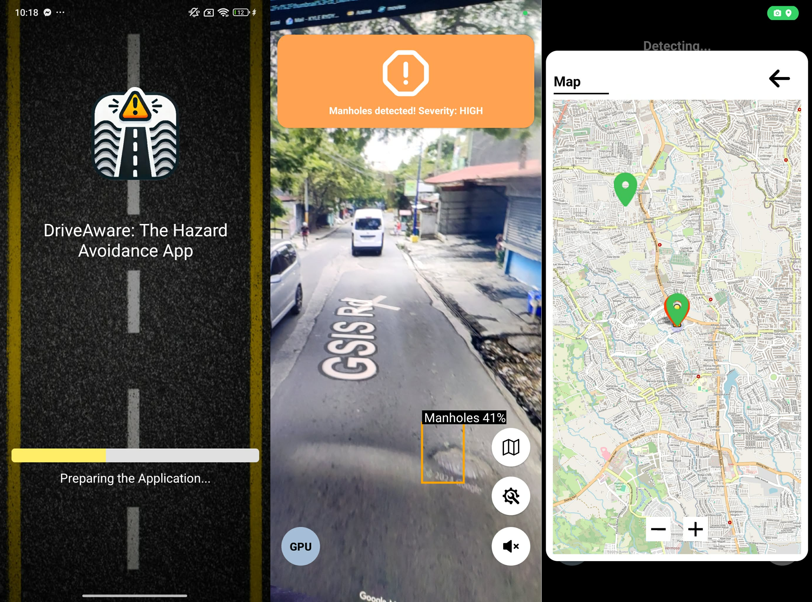

# DriveAware: Road hazard detector using YOLOv9 model

### Description
Leveraging  deep learning techniques and on-device computer vision,
DriveAware illustrates the feasibility of deploying real-time, 
AI-driven hazard detection systems on consumer-grade mobile platforms.

For more detailed information on the development and creation of DriveAware chck out our research paper
[DriveAware: AI-Driven Road Hazard Detection Using YOLOv9 and Mobile Vision](https://drive.google.com/file/d/1XblufBW-dk2NfxDmu59xBtQ39GzCzw9h/view?usp=drive_link)

### Contact
For any questions or feedback, feel free to open an [issue](https://github.com/DynnKyru/DriveAware-Road_hazard_detector/issues) in the repository.
Contact me at [kylerydynn20@gmail.com]

### Screenshots

### License

This repository includes code to integrate the YOLO model into mobile applications.

The code and work done to integrate YOLO for mobile use is licensed under the [Creative Commons Attribution 4.0 International (CC BY 4.0)](https://creativecommons.org/licenses/by/4.0/).

The YOLOv8, YOLOv9, YOLOv10, YOLOv11 model is licensed under the [GNU Affero General Public License (AGPL)](https://www.gnu.org/licenses/agpl-3.0.en.html).

